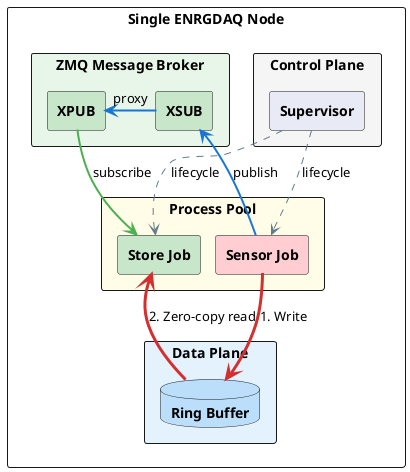
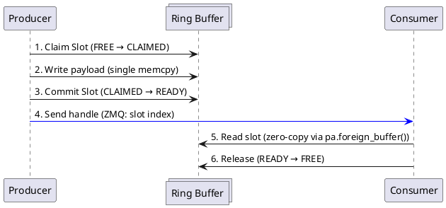
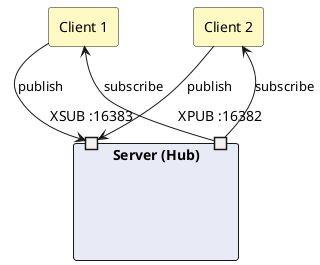

# Architecture

This page explains the internals of ENRGDAQ — how the supervisor, message
broker, DAQJobs, and shared memory work together to deliver high-throughput
data acquisition.

---

## Four-layer design

ENRGDAQ is organized into four logical layers:

```
┌────────────────────────────────────────────────┐
│  CONTROL PLANE   │  Supervisor orchestrator      │
├──────────────────┼───────────────────────────────┤
│  MESSAGE BROKER  │  ZMQ XPUB/XSUB proxy          │
├──────────────────┼───────────────────────────────┤
│  PROCESS POOL    │  Isolated DAQJob processes     │
├──────────────────┼───────────────────────────────┤
│  DATA PLANE      │  Shared memory ring buffer     │
└────────────────────────────────────────────────┘
```

### 1. Control Plane — Supervisor

A single `Supervisor` process manages the entire system:

- Reads TOML config files from the config directory
- Spawns each DAQJob as an independent OS process using `fork()`
- Monitors liveness via heartbeats and watchdog timers
- Restarts crashed jobs with configurable backoff
- Collects per-job statistics (message counts, latency, CPU/RSS)
- Hosts the CNC command server for remote management

### 2. Message Broker

The broker runs inside the supervisor process. It uses ZMQ's built-in
`zmq.proxy()` between XPUB and XSUB sockets:

- **XSUB** — receives messages from producers
- **XPUB** — distributes messages to subscribers based on topic prefix matching

All messages are serialized with **pickle** (not msgspec). This is deliberate:
pickle supports out-of-band `PickleBuffer` for zero-copy shared memory
transfers, which msgspec does not.

### 3. Process Pool — DAQJobs

Each DAQJob runs as a separate process with three daemon threads:

| Thread | Role |
|--------|------|
| `_consume_thread` | Receives messages via ZMQ SUB, puts them on `message_in` queue |
| `_publish_thread` | Takes messages from `message_out` queue, publishes via ZMQ PUB |
| `_report_thread` | Periodically sends stats and trace reports to supervisor (1 Hz) |

Jobs use `_put_message_out()` to send data and `handle_message()` to receive.
Every job is **isolated** — a crash in one job does not affect others.

### 4. Data Plane — Shared Memory

Bulk data (waveforms, PyArrow tables) bypasses ZMQ entirely. The producer
writes data directly to a slot in a **pre-allocated shared memory ring
buffer**. The consumer reads from the same slot — no copies, no serialization.

The ring buffer uses a claim-commit-release state machine:

- **FREE → CLAIMED** (producer claims a slot)
- **CLAIMED → READY** (producer finishes writing and commits)
- **READY → FREE** (consumer finishes reading and releases)

---

## Node architecture diagram

The diagram below shows all four layers and their interactions on a single
machine. Red arrows are the zero-copy data path; blue arrows are ZMQ pub/sub.



See the full diagram in
[host_node_architecture.puml](../diagrams/host_node_architecture.puml).

---

## Ring buffer mechanism

The ring buffer is the heart of ENRGDAQ's high-throughput zero-copy path.
It avoids all serialization and copy overhead for bulk data.



The handle sent over ZMQ contains only metadata (buffer name, slot index,
data size) — not the data itself. The consumer uses `pa.foreign_buffer()`
to directly access the shared memory, achieving true zero-copy reads.

Key properties:
- **Fixed-size slots** (1 MB default) — configurable via `ring_buffer_slot_size_kb`
- **Overwrite protection** — if all slots are occupied, the producer blocks
  (backpressure) rather than silently dropping data
- **Reference counting** — multiple consumers can read the same slot before
  it is released

See the full sequence diagram in
[ring_buffer_detail.puml](../diagrams/ring_buffer_detail.puml).

---

## Fault tolerance

The supervisor monitors all DAQJobs and recovers from failures:

1. **Watchdog** — each DAQJob has a watchdog timer. If the main thread
   hangs (e.g., stuck in a hardware read), the watchdog force-kills the
   process with `os._exit(1)`.
2. **Heartbeat** — DAQJobs send periodic heartbeat messages. If the
   supervisor doesn't receive heartbeats from a job, it assumes the
   process is dead.
3. **Restart** — the supervisor restarts crashed jobs with exponential
   backoff (1s, 2s, 4s, ... up to a configurable maximum).
4. **Isolation** — jobs are independent OS processes. A segmentation
   fault in one job does not crash others.

See the full recovery flow in
[fault_tolerance_flow.puml](../diagrams/fault_tolerance_flow.puml).

---

## Multi-machine federation

For deployments spanning multiple machines, ENRGDAQ uses a star topology:

- One **server** supervisor exposes XPUB/XSUB endpoints
- **Client** supervisors connect to the server and forward their messages
- The server relays messages between all clients

Messages are forwarded in one direction (client → server → all clients)
to prevent routing loops.



See the full multi-machine diagram in
[multi_node_topology.puml](../diagrams/multi_node_topology.puml).

---

## Class hierarchy

All DAQJobs inherit from `DAQJob`. Storage backends inherit from
`DAQJobStore` (which itself inherits from `DAQJob`):

```
DAQJob
  +-- DAQJobStore (abstract)
  |     +-- DAQJobStoreCSV
  |     +-- DAQJobStoreROOT
  |     +-- DAQJobStoreHDF5
  |     +-- DAQJobStoreMySQL
  |     +-- DAQJobStoreRedis
  |     +-- DAQJobStoreRaw
  |     +-- DAQJobStoreMemory
  +-- DAQJobAlert (abstract)
  |     +-- DAQJobAlertSlack
  +-- DAQJobHandleStats
  +-- DAQJobHandleAlerts
  +-- DAQJobHandleTraces
  +-- DAQJobBenchmark
  +-- DAQJobTest
  +-- DAQJobHealthcheck
  +-- DAQJobServeHTTP
  +-- DAQJobPCMetrics
  +-- DAQJobCamera
  +-- DAQJobXiaomiMijia
  +-- DAQJobCAENDigitizer
  +-- DAQJobCAENHV
  +-- DAQJobCaenN1081B
  +-- DAQJobCAENToolbox
```

See the full class hierarchy diagram in
[daqjob_hierarchy.puml](../diagrams/daqjob_hierarchy.puml).

---

## Control plane (CNC)

The Command & Control system provides remote management:

- **ZMQ ROUTER/DEALER** — binary request/response protocol for CNC commands
  (restart jobs, check status, send messages)
- **FastAPI REST API** — HTTP wrapper around the ZMQ protocol, provides
  `/status`, `/clients`, `/jobs`, `/restart`, `/templates` endpoints
- **Start topology** — one CNC server, multiple CNC clients

See [control_plane_stack.puml](../diagrams/control_plane_stack.puml).

---

## Next steps

- [Message Flow](message-flow.md) — detailed topic routing and zero-copy paths
- [Storage Backends](storage-backends.md) — comparison of all 7 store types
